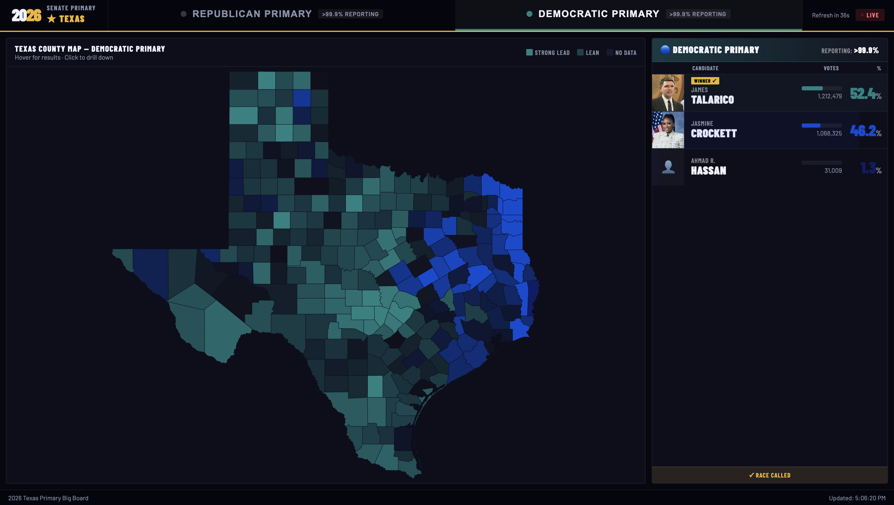

# Election Night Big Board

[A interactive county-level election map](https://texas-election-board.onrender.com/) for the 2026 Democratic and Republican primaries in Texas. Heavily inspired by the "big boards" used on TV by Steve Kornacki and John King. 

## Local Dev

To run locally:
1. `npm install -g serve`
2. `serve . -p 8080` 
3. visit http://localhost:8080/ on your browser.

Edit the `const CANDIDATES_URL` and `RESULTS_URL` to point to the csv files you would like to use for the backend. Or supply `null` and fall back on the default test values.

## Candidates Config

The provided CSV template (`candidates_template.csv`) file shows what data is needed for each candidate in the race:

- `candidate_id`: A unique ID provided for this candidate, will be referenced in the results file.
- `party`: D or R for Democratic or Republican candidate
- `name_first`: Candidate's first name
- `name_last`: Candidate's last name
- `incumbent`: `true` or `false` if this candidate should be flagged as an incumbent
- `photo_url`: optional URL to an image to show as a candidate's profile picture on the right side summary
- `hex_color`: color this candidate will be shaded as on the big board

## Results File

Check out the template (`results_template.csv`). Each row of the results file has:

- `candidate_id`: A unique ID for a candidate
- `county`: County name in all caps, used for joining to the map make sure to include a `STATEWIDE` county which is the results for the whole state combined.
- `votes`: Integer number of votes this candidate has received
- `pct_vote`: 0-100 float that shows the percent of the vote the candidate has received.
- `pct_reporting`: 0-100 float representing the percent of the precincts that has been reported, this should be the same for all candidates in a particular county.
- `called`: `true` or `false` if this county or statewide result has been called for a particular candidate.

